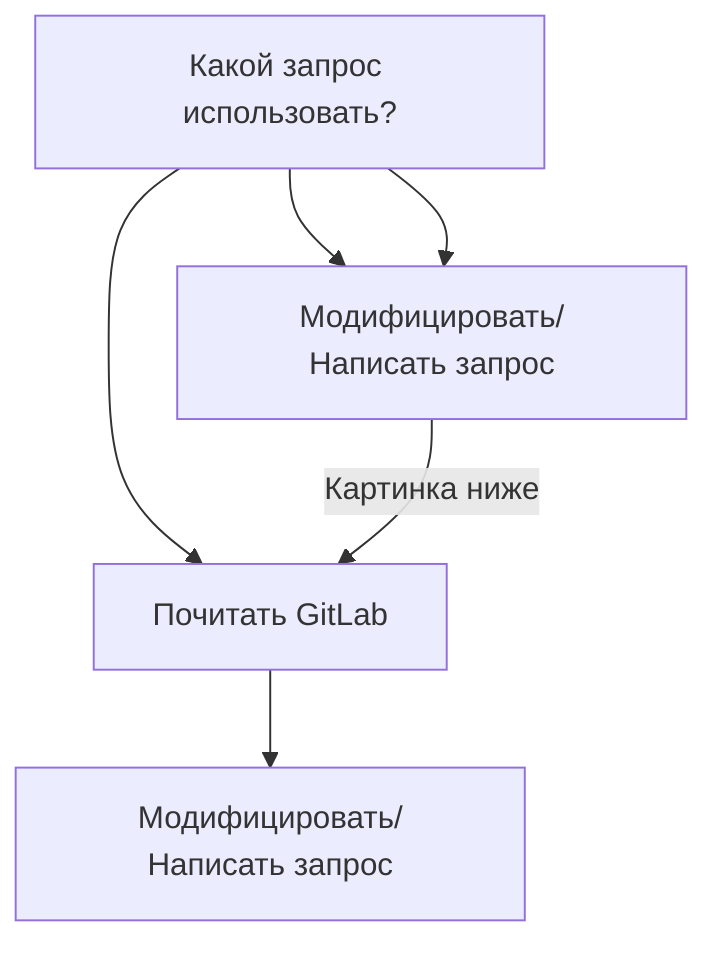

 

Доработки

 
          

[Описание профессий](https://www.thebalancecareers.com/list-of-information-technology-it-job-titles-2061498#types-of-it-jobs)

# Информация

[Обучение](https://gitlab.com/aruytehno/information/-/blob/main/Concepts/Learning.md)  
[Психология](https://gitlab.com/aruytehno/information/-/blob/main/Concepts/Psychology.md)  

Специализации IT:  

[Система контроля версий Git](https://gitlab.com/aruytehno/information/-/blob/main/Specializations/IT/Git.md)  
[Мануал по GitHub](https://gist.github.com/Jekins/2bf2d0638163f1294637#Headers)  

 Направления:  
[Тестирование](https://gitlab.com/aruytehno/information/-/blob/main/Specializations/IT/Testing.md)   
[Разработка](https://gitlab.com/aruytehno/information/-/blob/main/Specializations/IT/Development.md)  
[Хакинг](https://gitlab.com/aruytehno/information/-/blob/main/Specializations/IT/Hacking.md)  

